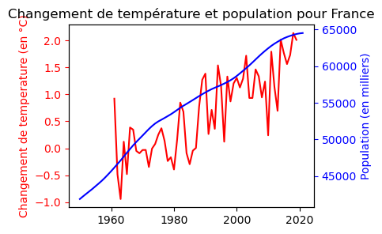
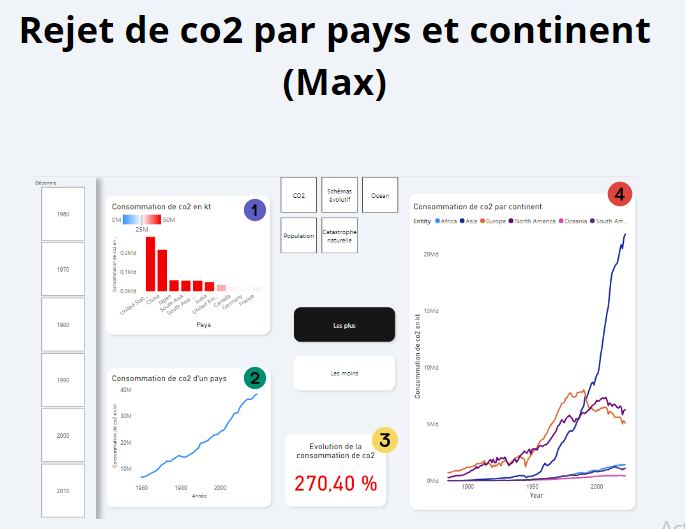
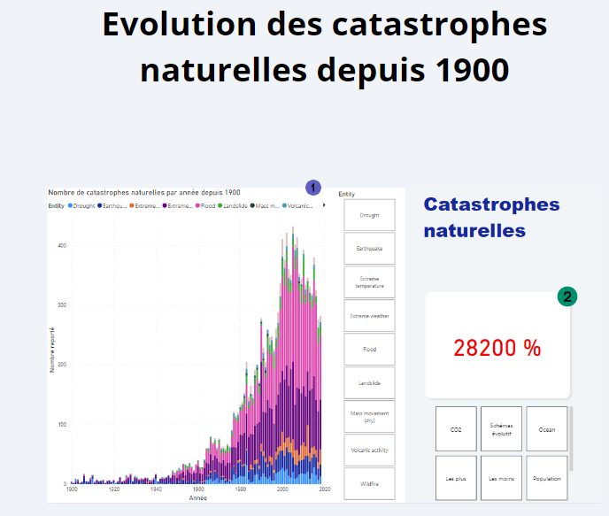

# Rapport Power BI

## Introduction

Depuis des décennies, la question du réchauffement climatique a occupé le devant de la scène dans les débats scientifiques, politiques et sociétaux.

Ce phénomène, amplifié par les activités humaines, constitue l'un des défis les plus pressants et complexes auxquels l'humanité est confrontée au 21ᵉ siècle. Alors que les preuves scientifiques continuent de s'accumuler, il devient impératif de reconnaître et de comprendre les impacts du réchauffement climatique sur notre planète.

Ce rapport de projet vise à présenter une analyse approfondie de l'existence et des manifestations du réchauffement climatique, en mettant en lumière les données scientifiques disponibles, les tendances observées et les conséquences prévisibles. En examinant les multiples facettes de ce phénomène, nous chercherons à fournir une perspective éclairée sur l'urgence d'agir pour atténuer les effets néfastes du changement climatique.

## Données et Méthodologie

Le projet se compose de deux parties principales :

1. **Script Python** : Un script Python est utilisé pour préparer et transformer les données brutes avant de les importer dans Power BI. Le script effectue les tâches suivantes :
   - Connexion à Google Cloud Storage pour récupérer les fichiers de données.
   - Transformation des données en DataFrame à l'aide de pandas.
   - Sauvegarde des données transformées sous format CSV pour une utilisation ultérieure dans Power BI.

2. **Rapport Power BI** : Le rapport est conçu pour analyser les données climatiques à travers diverses visualisations. Il est constitué des sections suivantes :
   - **Évolution du rejet de CO2** : Analyse de la consommation de CO2 dans le monde, par pays et continent, depuis 1750.
   - **Évolution de la température** : Visualisation des changements de température globale et océanique, ainsi que de l’étendue de la banquise et du niveau marin.
   - **Évolution des catastrophes naturelles** : Analyse du nombre de catastrophes naturelles depuis 1900.
   - **Corrélation entre le rejet de CO2 et le développement démographique** : Étude des relations entre les émissions de CO2 et la croissance démographique, avec une attention particulière sur des pays spécifiques comme la Chine.

## Utilisation

1. **Préparation des Données** : Exécutez le script Python pour transformer les données brutes.
2. **Importation dans Power BI** : Importez les fichiers de données transformées dans Power BI.
3. **Création des Visualisations** : Utilisez les outils de Power BI pour créer des graphiques et des tableaux de bord.
4. **Analyse et Rapport** : Analysez les visualisations et préparez le rapport final.

## Conclusion

Ce projet démontre l'intégration efficace de Power BI et de Python pour l'analyse des données climatiques. Power BI permet de créer des visualisations interactives et des rapports détaillés, tandis que le script Python facilite la préparation et la transformation des données nécessaires pour une analyse approfondie.

Des photos des graphiques réalisés sont disponibles dans ce répertoire pour illustrer les visualisations.

 

**Auteur** : Mouhssine Bairoune
